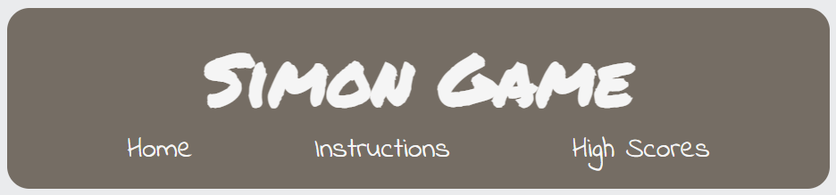

# Simon Says

## By Alejandro Spara Dominguez

#### This project was developed for the second project with the Code Institute and the Full Stack Development course.

### [Click here to view Site.](https://alexsd92.github.io/simon_game/)

### [Click here to view Repository.](https://github.com/AlexSD92/simon_game)

# Table of Contents:

1. [Why](#Why)
2. [User Experience(UX)](#user-experience-UX)
   1. [Target Audience](#target-audience)
   2. [User Stories](#user-stories)
   3. [Strategy](#strategy)
   4. [Scope](#scope)
   5. [Structure](#structure)
   6. [Skeleton](#skeleton)
      1. [Wireframes](#wireframes)
   7. [Surface](#surface)
      1. [Colours](#colours)
      2. [Typography](#typography)
      3. [Images & Icons](#images-&-icons)
3. [Features](#features)
   1. [Current Features](#current-features)
   2. [Future Features](#future-features)
4. [Technologies](#technologies)
5. [Testing](#testing)
   1. [Tests](#tests)
   2. [Bugs & Fixes](#bugs-&-fixes)
6. [Deployment](#deployment)
   1. [GitHub Pages](#github-pages)
   2. [Forking Repository](#forking-the-github-repository)
   3. [Cloning the project](#cloning-the-project)
7. [Credits](#credits)
8. [To Do](#To-Do)

# Why

# User Experience (UX)

## Target Audience

1. Anyone wanting to play a digital version of Simon Says.
2. Anyone looking for a challenging memory game.
3. Anyone looking to pass the time, casually play a game or some nostalgia.

## User Stories

- First time user:
    1. I would like to play Simon Says.
    2. I would like to play a memory game.
    3. I would like to play a challenging game.
    4. I would like to learn how to play the game.

- Returning User:
    1. I would like to play Simon Says.
    2. I would like to beat my previous score.
    3. I would like to view my previous scores.

## Strategy

Design a site with a focused style that does not distract from the Simon Says game. Consistent fonts, feedback sounds and colours will be used throughout the design for a visual appeal and simplicity.

## Scope

1. Create a Simon Says style game where the objective of the game is obvious and easy to understand.
2. Create a game that is fair and challenging at the same time.
3. Create different game modes.
4. Create a scoreboard.
5. Incorporate cheats, such as being able to skip a level.
6. Include audio-visual feedback.  

## Structure

The website was described with a structure in mind to focus on the gameplay elements, such as the Simon Game itself, high scores and instructions. There are no background images and the font style is kept consistent to not distract from the core elements of the website.

### Header

 - The header will include both a logo and navigation bar.
 
 

### Simon Game / Simon Controls

- The Simon Game has a start button to initiate the game.
- After being pressed, the start button disappears and the Simon buttons become the controls.
- The user can only click the Simon buttons during the user turn.

- If the user loses, the game over message will appear.
- At any point during game over, the user can click reset to reset the game.

- If the user loses, but gets a high score, the high score message will appear along with the option to submit a high score.

- If a high score is submitted, a message thanking the user for their high score will appear.

### Instructions Page

- The instruction page will contain a heading and description for each key step in the game.
- Each heading/description will be complemented by a gif animating the instruction as a visual guide.
  
  

### High Scores Page

- High scores will be sorted by value first, then alphabetically.
- High scores will decrease in font size from 1st to 3rd place.

  

### Footer

- Contains fontawesome GitHub that hyperlinks to GitHub.
- Contains my initials as a signature.

  
  

## Skeleton

### Wireframes

Wireframes for the site can be viewed [here](assets/images/readme/wireframes)

## surface

### Colors

The following color scheme for this site was selected by using [Coolors](https://coolors.co/).

- Header, Footer and Button background colors: #756d54
- Header, Footer, Button, Heading & Text font: #F5F5F5
- Simon Button colors: #FFBF00, #E83F6F, #2274A5 & #32936f

### Typography

The following fonts were used from [Google Fonts](https://fonts.google.com/?category=Handwriting&query=permanent):
- [Indie Flower](https://fonts.google.com/specimen/Indie+Flower?category=Handwriting#standard-styles)
  - Used in navbar, paragraphs and buttons.
- [Permanent Marker](https://fonts.google.com/specimen/Permanent+Marker?category=Handwriting&query=permanent)
  - Use in logo and headings.

### Images & Icons

[Fontawesome](https://fontawesome.com/) icons were used for the footer of the site to direct users to social media pages.

# Features

## Current Features

## Future Features

# Technologies

## Languages

- [HTML5](https://en.wikipedia.org/wiki/HTML5)
- [CSS3](https://en.wikipedia.org/wiki/CSS)
- [JavaScript](https://en.wikipedia.org/wiki/JavaScript)

## Other Technologies, Frameworks & Libraries

- [Audacity](https://www.audacityteam.org/)

# Testing

## Tests

### [HTML Validator](https://validator.w3.org/)

### [Jigsaw CSS Validator](https://jigsaw.w3.org/css-validator/validator)

### [JS HINT](https://jshint.com/)

### [Testing Sheet]

### [Chrome Dev Tools - Lighthouse](https://developers.google.com/web/tools/lighthouse/)

### Testing User Stories

## Bugs & Fixes

15/12/2021 - Bug identified where repeating objects in playGameChoice weren't animating correctly. This was fixed by adjusting the setTimeout to i*1000 to create delay in the iteration of the gameChoice array.
16/12/2021 - Bug identified where testChoice() kept defaulting to the else statement, the for loop needed adjusting so that it iterated through a slice of gameChoice that was equivalent to the length of userChoice. In code, it meant changing userChoice[i] === gameChoice[i] to userChoice[i] === gameChoice.slice(0, userChoice.length)[i].
18/12/2021 - 21/12/2021 - Bug identified where testChoice() would default to the next round regardless of whether the last choice was correct or incorrect. This was corrected for by having two overall if statements. The first tested if the userChoice < gameChoice in length, if it was, it iterated through the array for the length of userChoice and tested for equality. If equal, continue, if not equal, game over. The second tested whether the arrays are equal in length. If equal, a further test is done to check whether the last object in each array are equivalent. If they are equivalent, next round, if they aren't equivalent, game over.
26/12/2021 - Scores variable only returns a number if a number is declared. Specifying a number in another manner such as array.length returns 0. Resolved by using the original level variable as opposed to declaring a new variable, the score is the level.
27/12/2021 - Bug where if scoreList is empty, logic error. Resolved by moving pushScore inside of checkScore function.

# Deployment

## GitHub pages

## Forking The GitHub Repository

## Cloning the Project.

# Credits

- [Audacity](https://www.audacityteam.org/)
- [Freesound](https://freesound.org/)
   - [Freesound - Simon](https://freesound.org/people/Timbre/sounds/171398/)
- [Coolors](https://coolors.co/)
- [Screen to GIF](https://www.screentogif.com/)

---

[RETURN TO THE TOP](#Simon-Says)
