# Simon Says

## By Alejandro Spara Dominguez

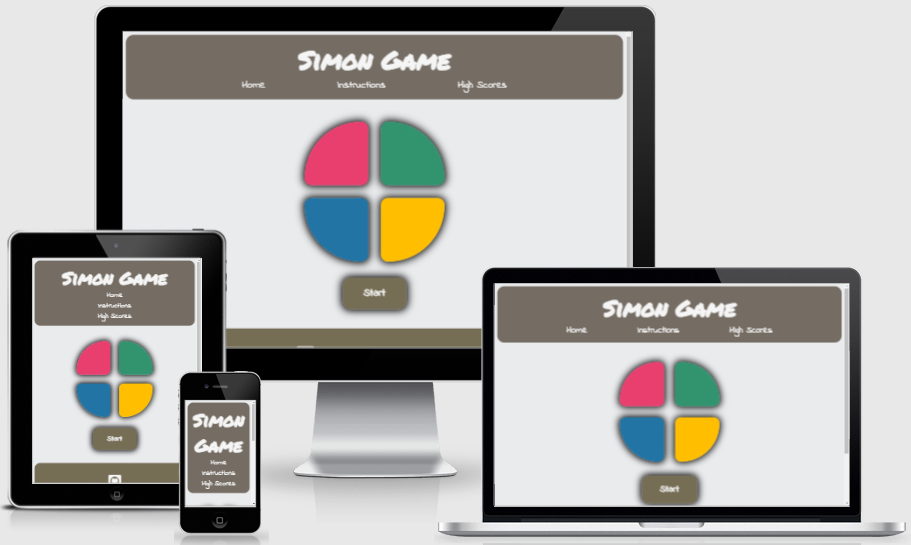

#### This project was developed for the second project with the Code Institute and the Full Stack Development course.

### [Click here to view Site.](https://alexsd92.github.io/simon_game/)

### [Click here to view Repository.](https://github.com/AlexSD92/simon_game)

# Table of Contents:

1. [Why](#Why)
2. [User Experience(UX)](#user-experience-UX)
   1. [Target Audience](#target-audience)
   2. [User Stories](#user-stories)
   3. [Strategy](#strategy)
   4. [Scope](#scope)
   5. [Structure](#structure)
   6. [Skeleton](#skeleton)
      1. [Wireframes](#wireframes)
   7. [Surface](#surface)
      1. [Colours](#colours)
      2. [Typography](#typography)
      3. [Images & Icons](#images-&-icons)
      4. [Sounds](#sounds)
3. [Features](#features)
   1. [Current Features](#current-features)
   2. [Future Features](#future-features)
4. [Technologies](#technologies)
5. [Testing](#testing)
   1. [Code Tests](#code-tests)
   2. [User Tests](#user-tests)
   3. [Bugs & Fixes](#bugs-&-fixes)
   4. [Observations](#observations)
6. [Deployment](#deployment)
   1. [GitHub Pages](#github-pages)
   2. [Forking Repository](#forking-the-github-repository)
   3. [Cloning the project](#cloning-the-project)
7. [Credits](#credits)
8. [To Do](#To-Do)

# Why

# User Experience (UX)

## Target Audience

1. Anyone wanting to play a digital version of Simon Says.
2. Anyone looking for a challenging memory game.
3. Anyone looking to pass the time, casually play a game or some nostalgia.

## User Stories

- First time user:
    1. I would like to play Simon Says.
    2. I would like to play a memory game.
    3. I would like to play a challenging game.
    4. I would like to learn how to play the game.

- Returning User:
    1. I would like to play Simon Says.
    2. I would like to beat my previous score.
    3. I would like to view my previous scores.

## Strategy

Design a site with a focused style that does not distract from the Simon Says game. Consistent fonts, feedback sounds and colours will be used throughout the design for a visual appeal and simplicity.

## Scope

1. Create a Simon Says style game where the objective of the game is obvious and easy to understand.
2. Create a game that is fair and challenging at the same time.
3. Create different game modes.
4. Create a scoreboard.
5. Incorporate cheats, such as being able to skip a level.
6. Include audio-visual feedback.  

## Structure

The website was described with a structure in mind to focus on the gameplay elements, such as the Simon Game itself, high scores and instructions. There are no background images and the font style is kept consistent to not distract from the core elements of the website.

### Header

 - The header will include both a logo and navigation bar.
 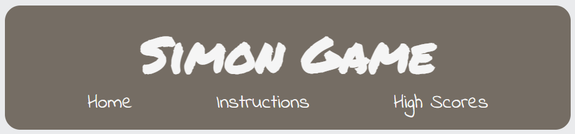
 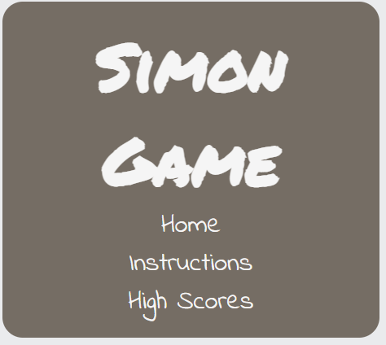

### Simon Game / Simon Controls

- The Simon Game has a start button to initiate the game.
- After being pressed, the start button disappears and the Simon buttons become the controls.
- The user can only click the Simon buttons during the user turn.
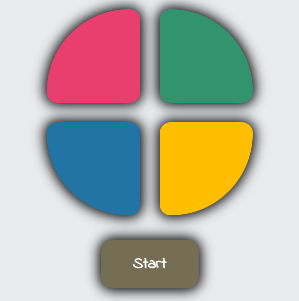

- If the user loses, the game over message will appear.
- At any point during game over, the user can click reset to reset the game.
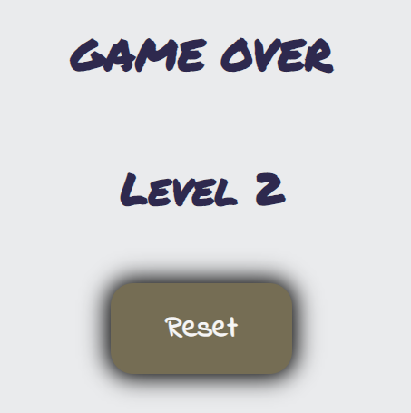

- If the user loses, but gets a high score, the high score message will appear along with the option to submit a high score.
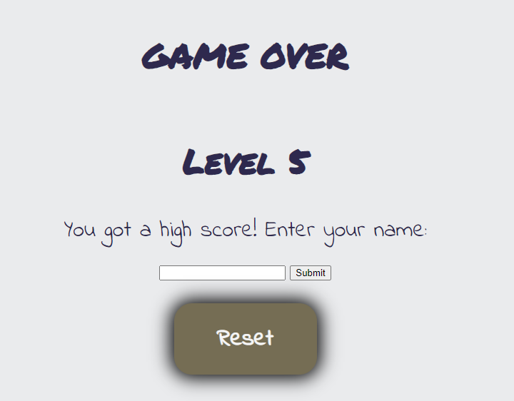

- If a high score is submitted, a message thanking the user for their high score will appear.
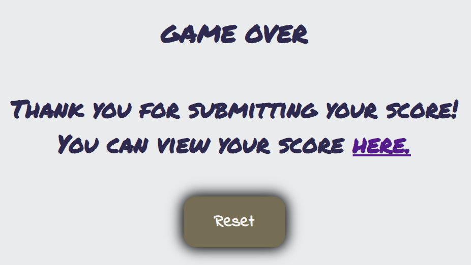

### Instructions Page

- The instruction page will contain a heading and description for each key step in the game.
- Each heading/description will be complemented by a gif animating the instruction as a visual guide.
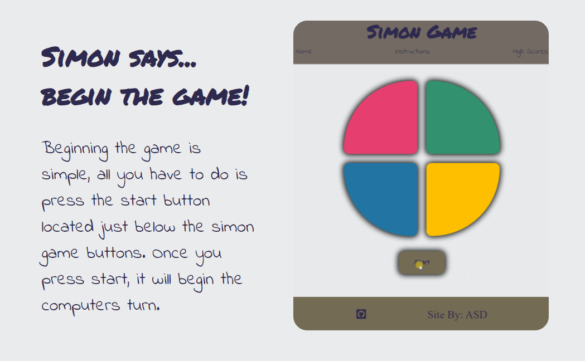  
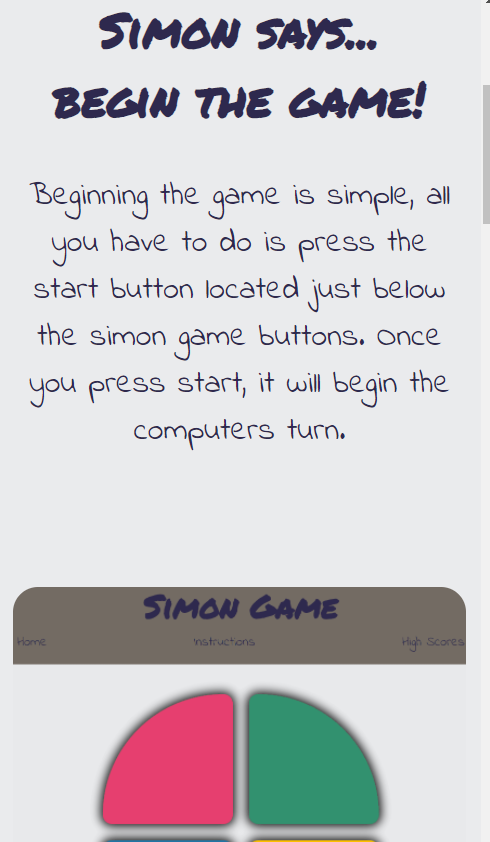  

### High Scores Page

- High scores will be sorted by value first, then alphabetically.
- High scores will decrease in font size from 1st to 3rd place.

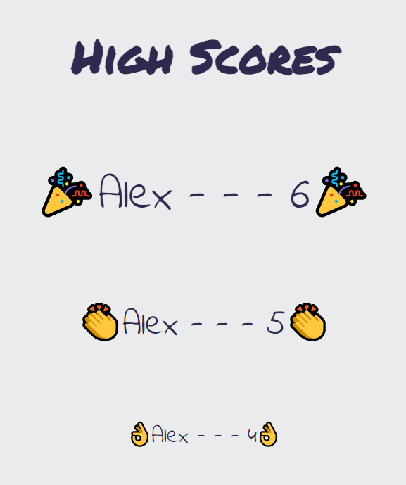  

### Footer

- Contains fontawesome GitHub that hyperlinks to GitHub.
- Contains my initials as a signature.

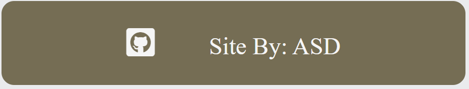  
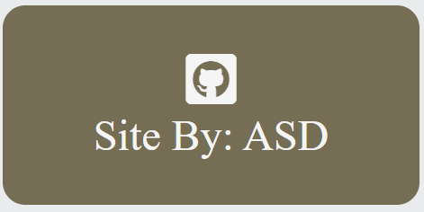  

## Skeleton

### Wireframes

Wireframes for the site can be viewed [here](assets/images/readme/wireframes).

## Surface

### Colors

The following color scheme for this site was selected by using [Coolors](https://coolors.co/).

- Header, Footer and Button background colors: #756d54
- Header, Footer, Button, Heading & Text font: #F5F5F5
- Simon Button colors: #FFBF00, #E83F6F, #2274A5 & #32936f

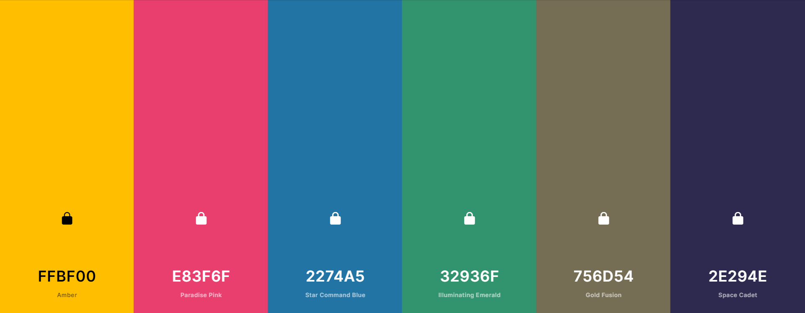.

### Typography

The following fonts were used from [Google Fonts](https://fonts.google.com/?category=Handwriting&query=permanent):

- [Indie Flower](https://fonts.google.com/specimen/Indie+Flower?category=Handwriting#standard-styles)
  - Used in navbar, paragraphs and buttons.

- [Permanent Marker](https://fonts.google.com/specimen/Permanent+Marker?category=Handwriting&query=permanent)
  - Use in logo and headings.

### Images & Icons

[Fontawesome](https://fontawesome.com/) icons were used for the footer of the site to direct users to social media pages.

### Sounds

[Freesound - Simon](https://freesound.org/people/Timbre/sounds/171398/) sounds were used for the audio feedback of the controls in the game.

All of the edited sounds that were used for this project can be found [here](assets/sounds).

# Features

## Current Features

- A home page where users can play the game.
- A method of recording user high scores locally if they achieve a high score.
- A game over message whenever the user loses against the computer.
- A reset button that allows the user to reset the game if they wish once the game is over.
- An instructions page where users that are unfamiliar with the game can learn to play the game.
- A high score page where users can view their high scores.

## Future Features

- A dark mode / night mode.
- Buttons to toggle features, such as button shapes, colours, sounds, etc.
- A challenge mode where the computer choices are returned much faster.

# Technologies

## Languages

- [HTML5](https://en.wikipedia.org/wiki/HTML5)
- [CSS3](https://en.wikipedia.org/wiki/CSS)
- [JavaScript](https://en.wikipedia.org/wiki/JavaScript)

## Other Technologies, Frameworks & Libraries

- [Audacity](https://www.audacityteam.org/)
- [Google Fonts](https://fonts.google.com/)
    - Used for importing fonts, allowing for the fonts to be available for all users.
- [Font Awesome](https://fontawesome.com/)
    - Font Awesome provides all the icons used for the site.
- [Git & GitBash](https://gitforwindows.org/)
    - Git for Windows provides a BASH emulation which allows for git to be used straight from the command line.
- [GitHub](https://github.com/)
    - Provided a Remote repository for the application. Allowing for my coding to be backed up online as I go.
- [Atom](https://atom.io/)
    - Development environment used to develop the code for this project.
- [Coolors](https://coolors.co/)
    - To select a colour pallet for site design.
- [Material Design Colour Tool](https://material.io/)
    - To select font colours to improve site accessibility.
- [Balsamiq](https://balsamiq.com/)
    - To create the wireframes for this site.

# Testing

## Code Tests

### [HTML Validator](https://validator.w3.org/)
- [Home Page]()
- [Instructions Page]()
- [High Scores Page]()

### [Jigsaw CSS Validator](https://jigsaw.w3.org/css-validator/validator)
- [Home Page]()
- [Instructions Page]()
- [High Scores Page]()

### [JS HINT](https://jshint.com/)

### [Chrome Dev Tools - Lighthouse](https://developers.google.com/web/tools/lighthouse/)

## User Tests

- First time user:
    1. I would like to play Simon Says / I would like to play a memory game.
      - User arrives at the 'Home' page and sees the game buttons followed by the start button. User clicks the start button and the game begins indicating that it is Simon's turn. Once Simon's turn is complete, the game indicates that it is the user's turn.
    2. I would like to play a challenging game.
      - User continues through the levels and the game increases in difficulty by requiring a greater commitment to memory.
    3. I would like to learn how to play the game.
      - User navigates to the 'Instructions' page and views the instructions for how to play the game.

- Returning User:
    1. I would like to play Simon Says.
      - User arrives at the 'Home' page and sees the game buttons followed by the start button. User clicks the start button and the game begins indicating that it is Simon's turn. Once Simon's turn is complete, the game indicates that it is the user's turn.
    2. I would like to beat my previous score.
      - User views the 'High Scores' page and sees their current score. User then navigates to the 'Home' page and attempt to beat their current score.
    3. I would like to view my previous scores.
      - User clicks the High Score link on the navigation menu and views their high scores.

## Bugs & Fixes

- 15/12/2021 - Bug identified where repeating objects in playGameChoice weren't animating correctly. This was fixed by adjusting the setTimeout to i*1000 to create delay in the iteration of the gameChoice array.

- 16/12/2021 - Bug identified where testChoice() kept defaulting to the else statement, the for loop needed adjusting so that it iterated through a slice of gameChoice that was equivalent to the length of userChoice. In code, it meant changing userChoice[i] === gameChoice[i] to userChoice[i] === gameChoice.slice(0, userChoice.length)[i].

- 18/12/2021 - 21/12/2021 - Bug identified where testChoice() would default to the next round regardless of whether the last choice was correct or incorrect. This was corrected for by having two overall if statements. The first tested if the userChoice < gameChoice in length, if it was, it iterated through the array for the length of userChoice and tested for equality. If equal, continue, if not equal, game over. The second tested whether the arrays are equal in length. If equal, a further test is done to check whether the last object in each array are equivalent. If they are equivalent, next round, if they aren't equivalent, game over.

- 26/12/2021 - Scores variable only returns a number if a number is declared. Specifying a number in another manner such as array.length returns 0. Resolved by using the original level variable as opposed to declaring a new variable, the score is the level.

- 27/12/2021 - Bug where if scoreList is empty, logic error. Resolved by moving pushScore inside of checkScore function.

## Observations

- High scores are categorised by value and then by name in alphabetical order. For example, if there are 2 scores of 3, one belonging to Albus and the other to Alex, Albus would take first place.

- If the gameChoice is green, green, and the user clicks green twice in too quick succession, the second 'press' animation will not play, but the game will continue as normal.

# Deployment

## GitHub Pages

The code for this site has been deployed via GitHub pages. This was done at the very start of the project in order to be able to test across multiple devices and view a live version of the site throughout all stages of development.

In order to deploy on GitHub pages, you must:

1. Create a GitHub account (if you have one already, skip this step).
2. Navigate to the [repository](https://github.com/AlexSD92/laughing-broccoli#GitHub-Pages).
3. Access the 'Settings' at the top right of the repository.
4. On the navigation menu on the left, click on 'Pages'.
5. On the 'Source' tab, ensure the dropdown that is selected is 'None'.
6. Select the 'main' branch, this may be called 'master'.
7. Save.
8. A URL will be generated for your site.
9. Process complete.

## Cloning & Forking The GitHub Repository

In order to make changes to this code without affecting the original code, you must fork the repository. This means that you will be given a copy of the code for that moment in time. In order to do this, you must:

1. Create a GitHub account (if you have one already, skip this step).
2. Navigate to the [repository](https://github.com/AlexSD92/laughing-broccoli#GitHub-Pages).
3. Near the top right, click 'Fork'.
4. A copy of the repository will be available for you to use within your own remote repositories.

In order to clone the code you must:

1. Create a GitHub account (if you have one already, skip this step).
2. Navigate to the [repository](https://github.com/AlexSD92/laughing-broccoli#GitHub-Pages) you would like to clone.
3. Near the top, select 'Code' in the dropdown.
4. Copy the HTTPS address.
5. Open Gitpod.
6. Navigate to the directory where you would like to create a new directory using the terminal.
    - Use the pwd command to know where you currently are.
    - Use cd followed by the directory name to change directories.
    - use mkdir followed by a new directory name to create a new directory.
7. Create a new directory (mkdir) named 'CKC Lifts'.
8. Change directory (cd) in to 'CKC Lifts'.
9. Enter 'git clone [insert HTTPS address here]'.
10. GitBash will clone the 'CKC Lifts' repository in to your chosen directory.

## Local Deployment

1. Download and open [GitBash](https://gitforwindows.org/) terminal.
2. Navigate to the directory where you would like to create a new directory.
  - Use the pwd command to know where you currently are.
  - Use cd followed by the directory name to change directories.
3. Create a new directory (mkdir) named 'simon_game'.
4. Set your username and email configuration.
  - git config --global user.name "FIRST_NAME LAST_NAME"
  - git config --global user.email "MY_NAME@example.com"
5. Create a GitHub account (if you have one already, skip this step).
6. Create a repository on GitHub and give it a suitable name.
7. After creating your repository, navigate to the code dropdown and copy the HTTPS link.
8. On GitBash, initialise the local directory you created (simon_game) as a Git repository by using git init, use git add . to stage all files and then make your first commit using git commit -m "first commit".
9. Add the URL for your repository where your local repository will be  pushed via git remote add origin (ADD YOUR URL HERE).
10. Push the changes in your local repository to GitHub using git push origin master.
11. From here on out you can use git add to add individual files and git commit and git push to add, commit and push files to your repository, respectively.
12. Open the repository using your preferred IDE, such as [Atom](https://atom.io/), [Visual Studio](https://code.visualstudio.com/), etc.

# Credits

1. [W3Schools](https://www.w3schools.com/)
    - An invaluable resource for this project in terms of documentation and tutorials.
    - Borrowed code for [flip cards](https://www.w3schools.com/howto/howto_css_flip_card.asp) on pricing.html page. This can also be found commented in style.css.

2. [MDN Web Docs](https://developer.mozilla.org/en-US/)
    - Another fantastic resource for this project in terms of documentation and tutorials.

3. [Stack Overflow](https://stackoverflow.com/)
    - Amazing forums with great and detailed discussions, not only demonstrating how to write code, but why it should be written that way.

4. [Code Institute](https://codeinstitute.net/)
    - Fantastic learning platform and amazing tutors on slack that are always willing to help.

5. [Audacity](https://www.audacityteam.org/)
    - An accessible audio editing software.

6. [Freesound](https://freesound.org/)
    - A large collection of royalty free sounds to use in web development.
    - [Freesound - Simon](https://freesound.org/people/Timbre/sounds/171398/)

7. [Coolors](https://coolors.co/)

8. [Screen to GIF](https://www.screentogif.com/)

9. Chris Quinn, Mentor
    - Excellent resource and a wealth of knowledge and insight. Lessons around CSS grid really added some invaluable knowledge and experience to my project.

---

[RETURN TO THE TOP](#Simon-Says)
